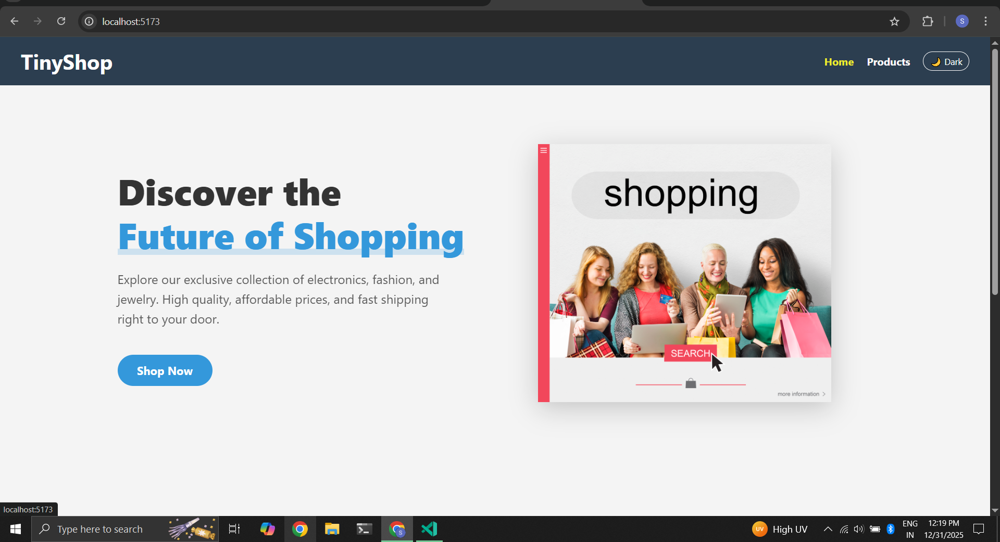
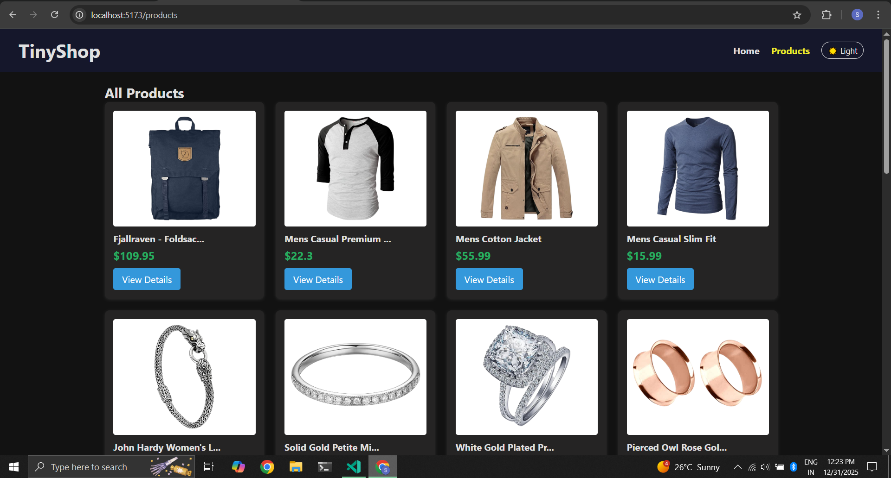
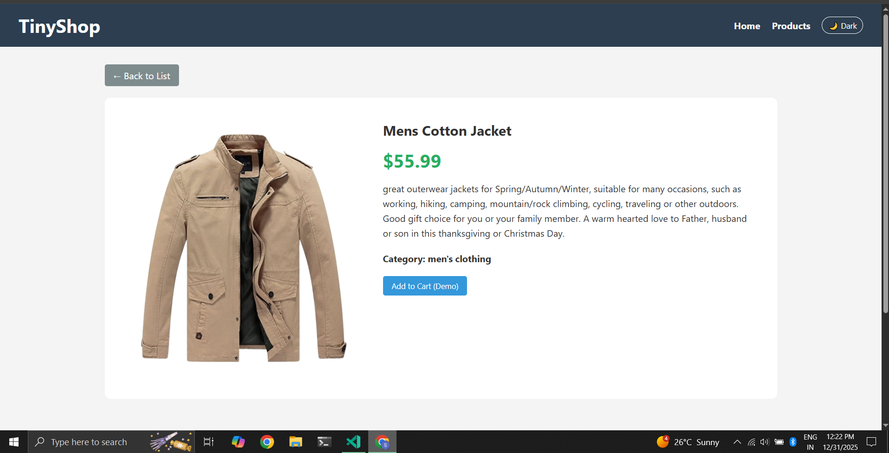
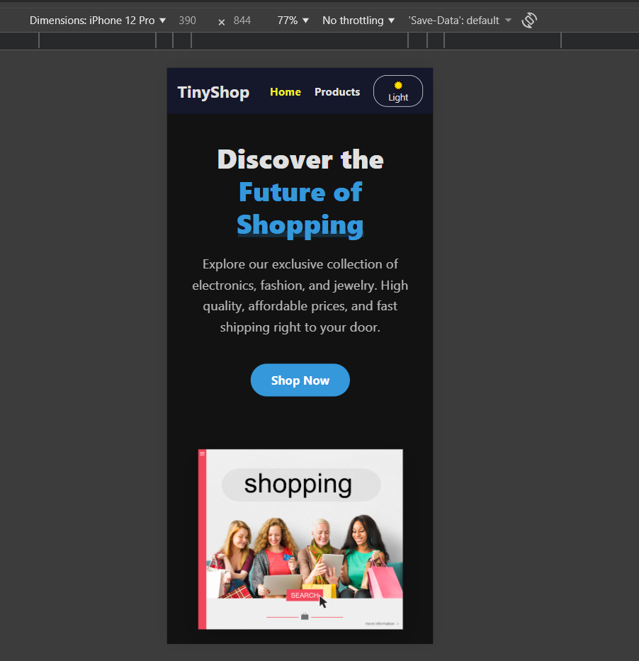
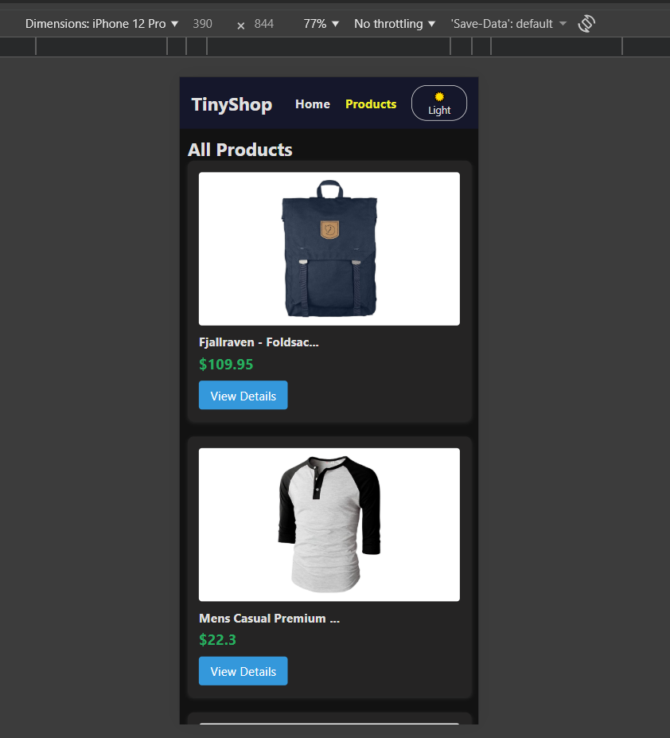

Project Report: TinyShop E-Commerce SPA

1. Project Overview
TinyShop is a responsive Single Page Application (SPA) developed using React.js. It simulates a functional e-commerce store where users can browse products, view detailed descriptions, and toggle between Light and Dark visual themes. The project demonstrates the mastery of modern frontend concepts including Component-based architecture, Client-side Routing, and API integration.

Technology Stack:
Frontend Library: React.js 
Styling: CSS3 
Routing: React Router DOM 
State Management: React Hooks 
Version Control: Git

2. API Selection
API Name: FakeStoreAPI
URL: https://fakestoreapi.com

Why this API?
Reliability: It provides consistent JSON data for products, including high-quality images, titles, prices, and categories.

3. Folder Structure
The project follows a modular file structure to ensure scalability and maintainability.
code
Text
src/
├── components/          # Reusable UI components
│   ├── Navbar.jsx        
│   ├── Footer.jsx       
│   └── Loader.jsx        
├── pages/               # Main Page Views
│   ├── Home.jsx         
│   ├── ProductList.jsx   
│   └── ProductDetail.jsx 
├── App.jsx               # Main entry point & Routing logic
├── App.css              # Global styles & CSS Variables

4. Key Features & Components

A. Routing & Navigation
We utilized React Router DOM to create a seamless user experience without page reloads.

Home (/): A landing page with a "Hero" section and value propositions.
Shop (/products): Displays data fetched from the API in a responsive grid.
Detail (/product/:id): Uses URL parameters to fetch and display specific product data.

B. Dark Mode
implemented dark mode for users who prefer dark screens.

C. Components
Navbar: Responsive flexbox layout. On mobile, it stacks vertically to accommodate smaller screens.
Product Card: Displays a thumbnail, title, and price. Includes a hover effect for better UX.
Loader: A visual cue shown while asynchronous data fetches are in progress.

5. Code Explanation
API Integration (Fetch)
We used the useEffect hook to trigger API calls when the component mounts.
code
JavaScript
useEffect(() => {
  fetch('https://fakestoreapi.com/products')
    .then(res => res.json())
    .then(data => {
        setProducts(data); // Store data in state
        setLoading(false); // Remove loading spinner
    })
    .catch(err => console.error(err));
}, []); // Empty dependency array ensures it runs only once

used postman to check if api is working perfectly.

6. Challenges & Solutions

Challenge 1: Mobile Responsiveness:
Issue: The Navbar content was overcrowding on small screens, and the product detail padding was too wide (40px), squashing the text.
Solution: Implemented Mobile Media Queries (max-width: 600px). We changed the Navbar flex-direction to column and reduced container padding to 15px.

Challenge 2: Footer Positioning:
Issue: The footer would float in the middle of the screen during loading states or on short pages.
Solution: We applied min-height: 100vh to the main container and used position: absolute with padding-bottom on the parent container to pin the footer to the bottom without breaking the CSS Grid layout of the products.

Challenge 3: Dark Mode Persistence:
Issue: When refreshing the page, the theme would reset to Light Mode.
Solution: Added logic to useState to initialize the theme based on localStorage.getItem('theme').

7. Project Screenshots

1. Home Page (Hero Section)

2. Product List Page (Grid View)

3. Product Detail Page (API Data Integration)

4. Mobile View (Responsive Menu & Dark Mode)

8. Links
GitHub Repository: https://github.com/Syeda130/Tiny-Shop

Conclusion:
TinyShop successfully demonstrates the core capabilities of a modern Single Page Application. By combining a clean UI, robust API integration, and user-centric features like Dark Mode, the project serves as a strong foundation for scalable web development.